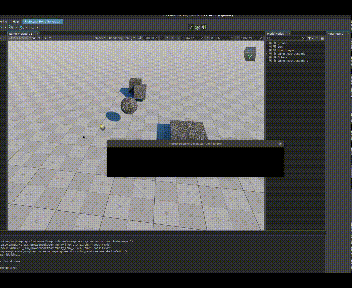

# Sea5kg / Stone Generator

UnigineEditor (2.17) Plugin for generation of meshes representing stones of various sizes and shapes.

**IN-PROGRESS**

[](https://developer.unigine.com/en/docs/2.17/) [](https://store.unigine.com/add-on/1ee2ef39-4458-6124-aefe-dbe1b97903ce/description) [](https://youtube.com/playlist?list=PL-Ky59xTi1WRCFocly-FhrFLLKwdbqEkO&feature=shared)


Plugin for Unigine Editor https://unigine.com/get-unigine/

Preview on Youtube:
- https://www.youtube.com/watch?v=7TaOFSUmlas




* License of plugin: MIT
* Unigine SDK 2.17 - tested on `Community` (Free)


## Build on linux:

```
$ docker run --rm -it -v `pwd`:/opt/sources sea5kg/unigine-editor-pluigns:latest ./build_plugin.py
```
