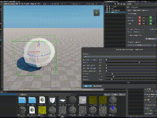

# prototype-stone-generator

Prototype of plugin for Unigine Editor 2.15: stone generator

**IN-PROGRESS**

[](https://developer.unigine.com/en/docs/2.15.1/)

Plugin for Unigine Editor https://unigine.com/get-unigine/

Preview on Youtube:
- https://youtu.be/n0WCDjWXM3I




* License of plugin: MIT
* Unigine SDK 2.15.1 - tested on `Community Free`


## Prebuilded versions

[/unigine-plugins/UnigineEditorPlugin_PrototypeStoneGenerator/](https://sea-kg.com/files/unigine-plugins/UnigineEditorPlugin_PrototypeStoneGenerator/)


## Build on linux:

```
$ docker run --rm -it -v `pwd`:/opt/sources sea5kg/unigine-editor-pluigns:latest ./build_plugin.py
```
